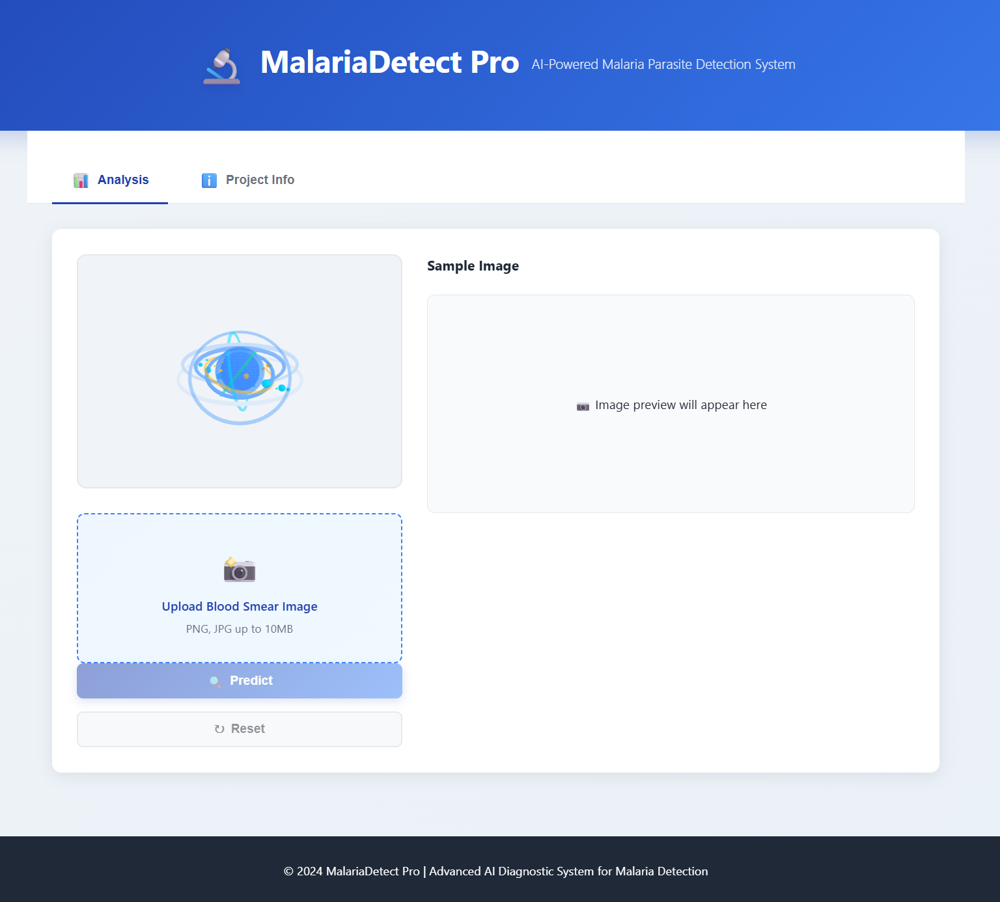
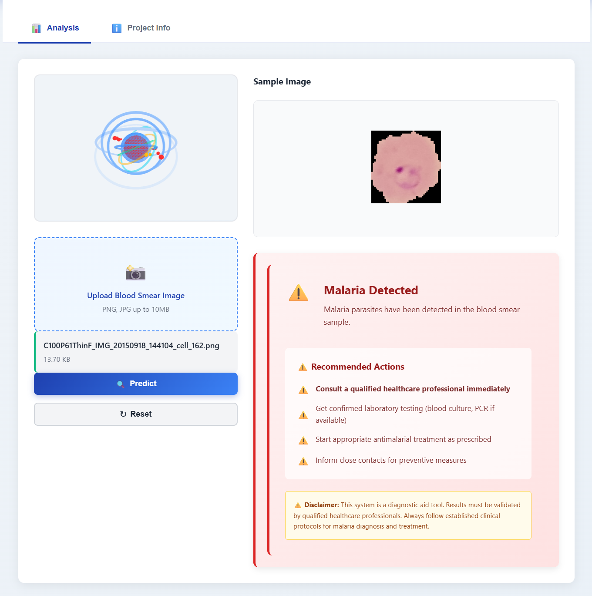
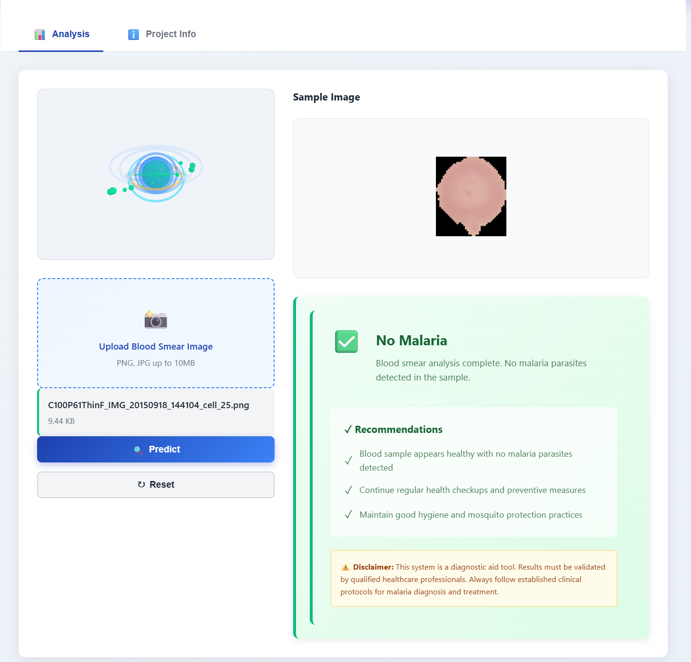
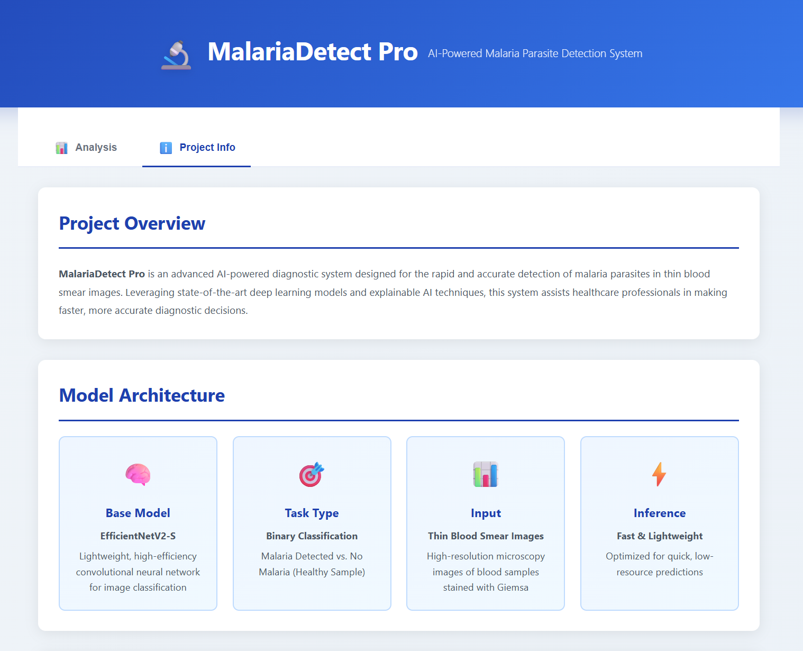
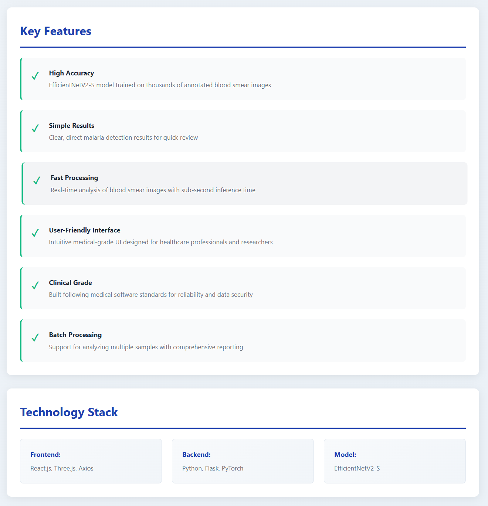
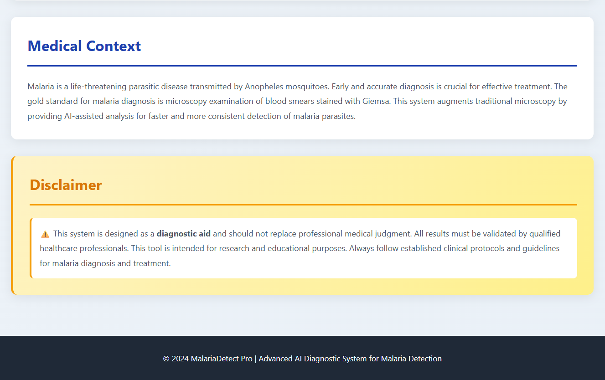

<div align="center">

# 🔬 MalariaDetect AI

### AI-Powered Malaria Parasite Detection from Blood Smear Images

An EfficientNetV2-S PyTorch model behind a Flask API, with a React (Vite)
frontend for uploading a blood-smear image and viewing the diagnostic result.


</div>

---

## 📸 Preview

<table>
<tr>
<td width="50%">

**Home / Upload screen**


</td>
<td width="50%">

**Positive result**


</td>
</tr>
<tr>
<td width="50%">

**Negative result**


</td>
<td width="50%">

**Project info tab**


</td>
</tr>
</table>

---

## 🧠 How It Works

1. The frontend lets the user upload a blood-smear image and POSTs it to the backend's `/predict` endpoint.
2. The backend preprocesses the image, runs it through the **EfficientNetV2-S** model, and returns a prediction (`Malaria Detected` / `No Malaria`) with a confidence score.
3. Model weights (`efficientnetv2_weights_aug.pth`) are **not** stored in this repo — they're downloaded by the backend at startup from a URL you provide via the `MODEL_URL` environment variable. See [Model Weights](#-model-weights) below.

---

## ✨ Key Features



| Feature | Description |
|---|---|
| ✅ **High Accuracy** | EfficientNetV2-S model trained on thousands of annotated blood smear images |
| ✅ **Simple Results** | Clear, direct malaria detection results for quick review |
| ✅ **Fast Processing** | Real-time analysis with sub-second inference time |
| ✅ **User-Friendly Interface** | Intuitive, medical-grade UI for healthcare professionals and researchers |
| ✅ **Clinical-Grade Build** | Follows medical software conventions for reliability and data handling |
| ✅ **Batch-Ready** | Designed to extend to multi-sample analysis and reporting |

---

## 🩸 Medical Context



> **⚠️ Disclaimer:** This is a research/educational tool, not a medical device.
> Predictions should not be used for actual diagnosis without clinical
> validation and review by a qualified healthcare professional.

---

## 📁 Project Structure

```
.
├── backend/                 Flask API (PyTorch inference)
│   ├── app.py
│   ├── requirements.txt
│   ├── Dockerfile
│   ├── .dockerignore
│   └── .env.example
├── frontend/
│   └── vite-project/        React + Vite frontend
│       ├── src/
│       ├── package.json
│       ├── vercel.json
│       ├── netlify.toml
│       └── .env.example
├── DEPLOY.md                 Full deployment walkthrough
└── .gitignore
```

---

## 🛠️ Technology Stack

| Layer | Stack |
|---|---|
| **Frontend** | React.js, Three.js, Axios |
| **Backend** | Python, Flask, PyTorch |
| **Model** | EfficientNetV2-S |

---

## 🚀 Local Development

### Backend

```bash
cd backend
pip install -r requirements.txt
# Place efficientnetv2_weights_aug.pth in this folder, OR set MODEL_URL
python app.py
```

Runs on `http://localhost:5000`. Check `http://localhost:5000/health`.

### Frontend

```bash
cd frontend/vite-project
npm install
echo "VITE_API_URL=http://localhost:5000" > .env
npm run dev
```

Runs on `http://localhost:5173` (Vite's default).

---

## 🧬 Model Weights

The `.pth` file is too large to commit to git comfortably and shouldn't be baked into a Docker image you rebuild often. Instead:

- Upload it to a free Hugging Face model repo
- Set `MODEL_URL` (backend env var) to its direct-download link
- The backend downloads it automatically the first time it boots

Full steps are in [`DEPLOY.md`](./DEPLOY.md).

---

## ☁️ Deployment

See [`DEPLOY.md`](./DEPLOY.md) for the full step-by-step guide:

**GitHub → Hugging Face (model weights) → Render/Railway (backend) → Vercel/Netlify (frontend)**

---

## 🔌 API Reference

| Endpoint | Method | Description |
|---|---|---|
| `/health` | `GET` | Health check, returns device + status |
| `/predict` | `POST` | `multipart/form-data` with field `file` (image) → prediction |
| `/info` | `GET` | Model metadata (input size, classes, etc.) |

---

## ⚙️ Environment Variables

**Backend** (`backend/.env.example`)

| Variable | Description |
|---|---|
| `MODEL_URL` | Direct-download link to `efficientnetv2_weights_aug.pth` |
| `FRONTEND_URL` | Comma-separated list of allowed CORS origins |
| `PORT` | Set automatically by most hosts; defaults to `5000` locally |

**Frontend** (`frontend/vite-project/.env.example`)

| Variable | Description |
|---|---|
| `VITE_API_URL` | URL of the deployed backend, no trailing slash |

---

## ⚠️ Disclaimer

This is a research/educational tool, **not a medical device**. Predictions
should not be used for actual diagnosis without clinical validation and
review by a qualified professional.

<div align="center">

*© 2024 MalariaDetect Pro — Advanced AI Diagnostic System for Malaria Detection*

</div>
